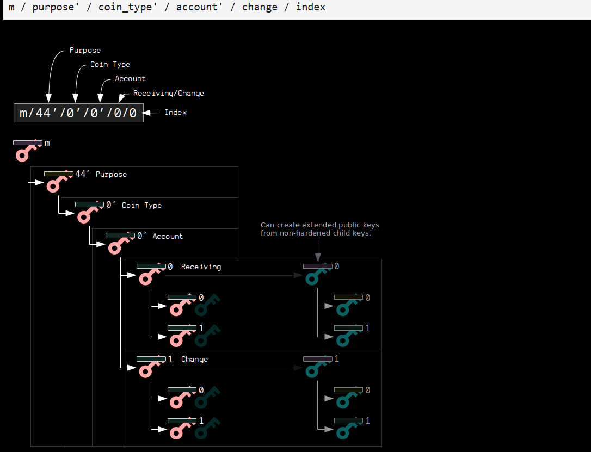
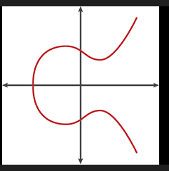

# Bitcoin HD Wallet (BIP44) - Testnet4

Создание биткоин-адресов из seed-фразы и отправка транзакций в testnet4.

---

## СОЗДАНИЕ БИТКОИН-АДРЕСА ИЗ SEED-ФРАЗЫ (HD-кошелёк BIP44)

### ПРИМЕР:
**Задача:** Найти адрес для отправки денег из кошелька Bitpay  
**Дано:** seed-фраза `"chalk cover vocal advice office close rifle agree destroy pole invite tumble"`  
**Итог:** `tb1q0d9858u4jv6qmlk7cum4d0uwxd2l54vk8mvpe6`

---

## ШАГ 1: 12 слов → 512-битный seed

**Берём:** `"chalk cover vocal advice office close rifle agree destroy pole invite tumble"`

Эти 12 слов — не случайный набор. Они закодированы по стандарту **BIP39**.

### Что такое BIP39:
Словарь BIP39: **2048** уникальных английских слов.

### Как работает:
1. Компьютер генерирует **128 случайных бит** (энтропия)
   ```
   Пример: 10110101001101110010... (128 бит)
   ```

2. **Контрольная сумма** (защита от опечаток):
   
   Берём 128 бит энтропии:
   ```
   10110101001101110010... (128 бит)
   ```
   
   Пропускаем через SHA256 (хэш-функция):
   ```
   Вход: 10110101001101110010... (128 бит)
   
   Внутри SHA256:
   1. Разбивает данные на блоки по 512 бит (дополняет нулями если нужно)
   2. Применяет 64 раунда математических операций:
      - Побитовые сдвиги (<<, >>)
      - XOR (исключающее ИЛИ: 1⊕1=0, 1⊕0=1)
      - Сложение по модулю 2^32
      - Использует 8 специальных констант (магические числа)
   3. Перемешивает биты так, что изменение 1 бита на входе → меняет ~50% бит на выходе
   
   Выход: 11010110101001011010110101001011010110101001011010110101001011010110... (256 бит)
   ```
   
   Берём первые 4 бита из хэша:
   ```
   1101 ← эти 4 бита
   ```
   
   Добавляем к 128 битам энтропии:
   ```
   10110101001101110010... (128 бит) + 1101 (4 бита) = 132 бита
   ```

3. Делим 132 бита на 12 частей по **11 бит**:
   - 11 бит = 2048 возможных значений → индекс слова в словаре BIP39
   - **Пример:** биты `00101101101` → число `365` → слово `"cover"`
   ```
   132 бита ÷ 11 бит = 12 слов
   ```

### Безопасность:
- **128 бит энтропии** = 2^128 комбинаций = **340 ундециллионов** вариантов
- (больше атомов в Солнечной системе — невозможно перебрать)

### Контрольная сумма:
Если ошибётесь хотя бы в одном слове → кошелёк скажет **"неверная фраза"**

### Преобразование 12 слов в seed (PBKDF2):

Теперь у нас есть 12 слов, нужно превратить их в 512-битный seed.

**Берём:**
```
"chalk cover vocal advice office close rifle agree destroy pole invite tumble"
```

**Процесс PBKDF2-HMAC-SHA512:**

```
Шаг 1: Подготовка данных
───────────────────────
Пароль: "chalk cover vocal advice office close rifle agree destroy pole invite tumble"
Salt:   "mnemonic"

Что такое salt:
Salt (соль) — это дополнительная строка, которая смешивается с паролем перед хэшированием.

Зачем нужна соль:
Без соли: SHA512("chalk cover...") → всегда один и тот же хэш
Со солью: SHA512("chalk cover..." + "mnemonic") → другой хэш

Почему "mnemonic":
- Это просто константа из стандарта BIP39
- Все BTC-кошельки используют одну и ту же соль

Шаг 2: Применяем PBKDF2 (Password-Based Key Derivation Function 2)
────────────────────────────────────────────────────────────────
PBKDF2 — это "растягивание ключа" для защиты от brute-force атак

Что делает:
1. Берёт пароль ("chalk cover...") + salt ("mnemonic")
2. Пропускает через HMAC-SHA512 (хэш с ключом). Только тот, кто знает ключ, может создать правильный хэш.
3. Повторяет это 2048 раз (итераций)
4. Каждая итерация использует результат предыдущей

   Как работают 2048 итераций:
   
   Итерация 1:
   U1 = HMAC-SHA512("chalk cover...", "mnemonic" + 1)
      = a1b2c3d4e5f6... (64 байта)
   
   Итерация 2:
   U2 = HMAC-SHA512("chalk cover...", U1)
      = HMAC-SHA512("chalk cover...", a1b2c3d4e5f6...)
      = 7f8e9d0c1b2a... (64 байта)
      ↑ используем результат U1 как входные данные!
   
   Итерация 3:
   U3 = HMAC-SHA512("chalk cover...", U2)
      = HMAC-SHA512("chalk cover...", 7f8e9d0c1b2a...)
      = 3c4d5e6f7a8b... (64 байта)
      ↑ используем результат U2!
   
   ...продолжаем 2048 раз...
   
   Итерация 2048:
   U2048 = HMAC-SHA512("chalk cover...", U2047)
         = 9e8f7d6c5b4a... (64 байта)
   
   Финальный результат (XOR всех итераций):
   seed = U1 ⊕ U2 ⊕ U3 ⊕ ... ⊕ U2048
   
   Что такое XOR (⊕):
   Побитовая операция "исключающее ИЛИ":
   0 ⊕ 0 = 0
   0 ⊕ 1 = 1
   1 ⊕ 0 = 1
   1 ⊕ 1 = 0
   
   Пример XOR:
   U1    = 10110101...
   U2    = 11001010...
   U1⊕U2 = 01111111...
           ↑ побитово сравниваем и применяем XOR

Зачем 2048 итераций:
- Замедляет атаки: вместо 1 хэша нужно вычислить 2048
- Если злоумышленник пробует 1 млн паролей → ему нужно 2 млрд операций
- Для законного пользователя: 2048 операций = доли секунды

```

**Результат:**
```
seed = a3f8b2c1d4e5f6a7b8c9d0e1f2a3b4c5d6e7f8a9b0c1d2e3f4a5b6c7d8e9f0a1...
       b2c3d4e5f6a7b8c9d0e1f2a3b4c5d6e7f8a9b0c1d2e3f4a5b6c7d8e9f0a1b2c3
       
       ↑ 64 байта = 512 бит
```

Этот seed — основа для генерации ВСЕХ приватных ключей кошелька.

---

## ШАГ 2: Seed → Master Private Key (корень "m")

**Берём:** seed (64 байта)

### Алгоритм:
```
seed → HMAC-SHA512 с ключом "Bitcoin seed" → 64 байта:
  - Первые 32 байта = master private key
  - Последние 32 байта = chain code (для генерации дочерних ключей)
```

Получили узел **"m"** в дереве BIP32 (корень).

---

## ШАГ 3: Применяем путь m/44'/1'/0'/0/0

**Берём:** master key (m) + chain code

### Что такое "путь":

Последовательность деривации ключей. Каждый `"/"` = новый ключ из предыдущего.  
**Дерево:** `m` (корень) → `44'` (ветвь) → `1'` → `0'` → `0` → `0` (лист-адрес)

### Структура пути:
```
m / 44' / coin_type' / account' / change / address_index
```

### Разбираем m/44'/1'/0'/0/0:

#### `m` → master key (корень дерева)

#### `/44'` → purpose (тип адреса)
- `44` = BIP44 standard (поддерживает P2WPKH для tb1q... адресов)
- Штрих `'` = **hardened деривация** (безопасно: нельзя вычислить приватный ключ из публичного)

#### `/1'` → coin_type (сеть)
- `0'` = Bitcoin mainnet
- `1'` = Bitcoin testnet ← **мы здесь**

#### `/0'` → account (номер счёта)
Можно создавать несколько счетов:
- `0'` = личный
- `1'` = бизнес
- `2'` = сбережения

#### `/0` → change (тип адреса)
- `0` = **receiving** (для получения денег, показываете другим)
- `1` = **change** (для сдачи, внутренние адреса)
- **БЕЗ штриха** — можно генерировать адреса из публичного ключа

#### `/0` → address_index (порядковый номер)
- `0` = первый адрес
- `1` = второй
- `2` = третий...
- Кошелёк генерирует новый адрес для каждой транзакции (приватность)

### Процесс деривации:
```
Каждый шаг "/" = HMAC-SHA512(текущий_ключ + chain_code + индекс)
m → /44' → /1' → /0' → /0 → /0
```

**Получаем:** конечный приватный ключ для адреса `m/44'/1'/0'/0/0`

**Пример конкретного приватного ключа:**
```
Приватный ключ (32 байта в hex (hexadecimal, шестнадцатеричная система)):
5a8c7b2e3d4f6a1b9c0e8d7f4a3b2c1d0e9f8a7b6c5d4e3f2a1b0c9d8e7f6a5b

↑ 64 символа hex = 32 байта = 256 бит

Это случайное число от 1 до ~2^256
```

---

## ШАГ 4: Приватный ключ → Публичный ключ

**Берём:** приватный ключ (32 байта)
```
5a8c7b2e3d4f6a1b9c0e8d7f4a3b2c1d0e9f8a7b6c5d4e3f2a1b0c9d8e7f6a5b
```

### Алгоритм (эллиптическая кривая secp256k1):

**Что такое эллиптическая кривая:**
Это математическое уравнение: `y² = x³ + 7`

График выглядит как симметричная кривая линия.


**Базовая точка G (генератор):**

**Что это:**
Точка G — это **стартовая позиция** для всех Bitcoin-адресов.

**Конкретные значения:**
```
G = (x: 55066263022277343669578718895168534326250603453777594175500187360389116729240,
     y: 32670510020758816978083085130507043184471273380659243275938904335757337482424)

Это просто два БОЛЬШИХ числа (координаты точки на математической кривой)
```

**Зачем нужна базовая точка:**
```
1. Все в мире Bitcoin используют ОДНУ И ТУ ЖЕ точку G
2. Это как "начало координат" — общая точка отсчёта
```

**Почему координаты G такие огромные:**
```
Числа специально выбраны ГИГАНТСКИМИ для безопасности:
- x ≈ 10^76 (77 цифр)
- y ≈ 10^76 (77 цифр)

Это делает невозможным угадать приватный ключ
```

**Как получить публичный ключ:**
```
Приватный ключ = число k
Публичный ключ = точка P

P = k × G

Результат: новая точка P(x, y) на кривой
```

**Наш реальный пример:**
```
Приватный ключ (число):
k = 0x5a8c7b2e3d4f6a1b9c0e8d7f4a3b2c1d0e9f8a7b6c5d4e3f2a1b0c9d8e7f6a5b
     ↑ префикс 0x означает "это hex-число"

Публичный ключ (точка):
P = k × G = (x: 789abc123..., y: 456def789...)

**Проблема:**
Публичный ключ — это точка на кривой с двумя координатами (x, y).
Обе координаты — огромные числа по 32 байта каждая.

**Решение — сжатие:**

```
Полный формат (несжатый):
04 + x (32 байта) + y (32 байта) = 65 байт
↑
префикс 04 = "это полная точка"

Пример:
04 789abc123def456... (x-координата, 32 байта)
   456def789abc123... (y-координата, 32 байта)
```

```
Сжатый формат:
02/03 + x (32 байта) = 33 байта
↑
префикс 02 = "y чётная"
префикс 03 = "y нечётная"

Пример:
02 789abc123def456... (только x-координата, 32 байта)
```

**Как это работает:**

```
1. У нас есть уравнение кривой: y² = x³ + 7

2. Если известен x, можем найти y:
   y² = x³ + 7
   y = ±√(x³ + 7)
   
3. Два возможных значения y:
   - Одно чётное
   - Одно нечётное
   
4. Префикс указывает, какое y брать:
   02 → берём чётное y
   03 → берём нечётное y
```

**Кто определяет префикс:**

```
Префикс выбирается АВТОМАТИЧЕСКИ на основе реального значения y:

Шаг 1: Вычисляем полный публичный ключ
k × G = P(x, y)  ← получаем конкретные x и y

Шаг 2: Проверяем y — чётное или нечётное
if (y % 2 == 0):  ← y делится на 2 без остатка
    префикс = 02  ← чётное
else:
    префикс = 03  ← нечётное
```

**При восстановлении:**

```
Получили сжатый ключ: 02789abc123...

Шаг 1: Видим префикс 02 → значит y должно быть чётным

Шаг 2: Берём x = 789abc123...

Шаг 3: Вычисляем y² = x³ + 7

Шаг 4: Извлекаем корень: y = ±√(x³ + 7)
        Получаем два варианта

Шаг 5: Выбираем ЧЁТНЫЙ вариант (потому что префикс = 02)

Результат: восстановили полную точку (x, y)
```

**Зачем сжимать:**
```
Экономия места:
- В блокчейне каждый байт стоит денег (комиссия)
- 65 байт → 33 байта = экономия ~50%

Безопасность не страдает:
- Публичный ключ тот же, просто записан компактнее
```

**Главное:**
```
Сжатие = записываем только x, а y восстанавливаем из уравнения кривой
Префикс 02/03 = подсказка, какой из двух вариантов y выбрать
```

### Это односторонняя функция:

**Легко (приватный → публичный):**
```
k = 12345
P = 12345 × G

Компьютер делает ~15 операций удвоения точки
Время: миллисекунды
```

**Невозможно (публичный → приватный):**
```
Дано: P = (x, y) — точка на кривой
Найти: k такое, что k × G = P

Проблема дискретного логарифма на эллиптической кривой:
- Перебор всех k от 1 до 2^256 = 10^77 операций

Вывод: математически невозможно восстановить k из P
```

---

## ШАГ 5: Публичный ключ → Адрес tb1q...

**Берём:** публичный ключ (33 байта сжатый формат)
```
02789abc123def456...
```

### Алгоритм подробно:

**Шаг 1: SHA256 (первое хэширование)**

```
Берём публичный ключ: 02789abc123def456... (33 байта)

Применяем SHA256:
SHA256(pubkey) = a1b2c3d4e5f6g7h8i9j0k1l2m3n4o5p6q7r8s9t0u1v2w3x4y5z6... (32 байта)

Зачем SHA256:
- Преобразует 33 байта в 32 байта
- Размешивает данные
```

**Шаг 2: RIPEMD160 (второе хэширование)**

```

Применяем RIPEMD160:
RIPEMD160(SHA256(pubkey)) = f4e3d2c1b0a9... (20 байт)

Зачем RIPEMD160:
- Сжимает 32 байта до 20 байт
- Еще больше "перемешивает" данные
- 20 байт = 160 бит → достаточно для безопасности
```

**Зачем два хэша (SHA256 + RIPEMD160):**
```
1. Безопасность: если одна хэш-функция взломана → вторая защитит
2. Компактность: 33 байта → 20 байт (экономия места в блокчейне)
3. Приватность: по адресу нельзя узнать публичный ключ (пока не потратите монету)
```

---

**Шаг 3: Bech32 кодирование**

**Что такое bech32:**
Специальный способ записи адреса, который:
- Использует только маленькие буквы и цифры (легко читать)
- Исключает похожие символы (0 и O, 1 и l)
- Имеет встроенную защиту от опечаток

**Процесс:**

```
Берём: hash160 = f4e3d2c1b0a9876543210fedcba9876543210fed (20 байт)

Шаг 3.1: Добавляем префикс
────────────────────────
Префикс зависит от сети:
- "bc" = Bitcoin mainnet (настоящие деньги)
- "tb" = Bitcoin testnet (тестовые монеты)

Мы используем testnet → префикс "tb"
```

```
Шаг 3.2: Добавляем версию witness
────────────────────────────────
Версия = 0 (SegWit v0, P2WPKH адреса)

Результат пока: "tb" + "0" + hash160
```

```
Шаг 3.3: Конвертируем в 5-битные группы
──────────────────────────────────────
hash160 (20 байт = 160 бит)

Разбиваем на группы по 5 бит:
11110 10011 10011 ... (32 группы по 5 бит)

Каждая группа 5 бит = число от 0 до 31
```

```
Шаг 3.4: Преобразуем в символы bech32
────────────────────────────────────
Таблица bech32 (32 символа):
qpzry9x8gf2tvdw0s3jn54khce6mua7l

Пример:
Группа 11110 (30) → символ 'l'
Группа 10011 (19) → символ 'k'
Группа 00000 (0)  → символ 'q'

Получаем строку: "0d9858u4jv6qmlk7cum4d0uwxd2l54vk8"
```

```
Шаг 3.5: Вычисляем контрольную сумму (checksum)
──────────────────────────────────────────────
Применяем алгоритм BCH:
"tb" + версия 0 + данные → полиномиальное деление → "mvpe6"

Защита от опечаток:
✅ Обнаруживает замену/удаление/добавление/перестановку символов
✅ Кошелек пересчитывает checksum при вводе адреса

```

```
Шаг 3.6: Собираем финальный адрес
────────────────────────────────
префикс + разделитель + данные + checksum

tb + 1 + q0d9858u4jv6qmlk7cum4d0uwxd2l54vk8 + mvpe6
│    │   │                                   │
│    │   │                                   └─ контрольная сумма (6 символов)
│    │   └───────────────────────────────────── hash160 в bech32 (38 символов)
│    └───────────────────────────────────────── разделитель "1"
└────────────────────────────────────────────── префикс сети "tb" (testnet)
```

---

## СОЗДАНИЕ И ОТПРАВКА ТРАНЗАКЦИИ (HD Wallet BIP44)

### 1. СКАНИРОВАНИЕ АДРЕСОВ (gap limit):

**Процесс сканирования:**
```
Для каждого индекса i = 0, 1, 2, 3...
1. Генерируем адрес: m/44'/1'/0'/0/i
2. Запрашиваем UTXO (Unspent Transaction Output = непотраченные монеты) для этого адреса
3. Если нашли монеты:
   - Сохраняем UTXO + приватный ключ + адрес
   - Сбрасываем счётчик пустых адресов
4. Если адрес пустой:
   - Увеличиваем счётчик пустых
5. Если 20(Gap limit) подряд пустых → стоп

Результат: массив UTXO с ключами для подписания
```

**Структура UTXO:**
```
{
  txid: "abc123def456...",           // ID транзакции, откуда пришли монеты
  vout: 0,                           // номер выхода в той транзакции (индекс)
  value: 1500000,                    // сумма в сатоши (0.015 BTC)
  address: "tb1q0d9858u4jv6...",     // адрес владельца (наш адрес)
  scriptPubKey: "0014f4e3d2c1b0a9..." // условие траты монеты
}
```

Чтобы потратить монеты → нужно доказать, что у вас есть ключ
```

**Формат для P2WPKH (Native SegWit, tb1q...):**

```
scriptPubKey = OP_0 + hash160(publicKey)

Что такое OP_0:
──────────────
OP_0 — это команда (opcode) в языке Bitcoin Script

Язык Script:
- Bitcoin использует специальный язык для условий трат
- Состоит из команд (opcodes): OP_0, OP_DUP, OP_HASH160, OP_CHECKSIG...
- Каждая команда = 1 байт (число от 0x00 до 0xFF)

OP_0 в деталях:
- Использование в SegWit: обозначает версию witness = 0

Почему "версия witness = 0":
- SegWit v0 (BIP141, 2017) — первая версия SegWit
- SegWit v1 (Taproot, 2021) использует OP_1 (0x51)
- Версия позволяет обновлять протокол без ломки старых адресов

Разбор scriptPubKey:
────────────────────
OP_0              = 0x00 (1 байт) — версия witness
длина данных      = 0x14 (1 байт) — 20 байт следом
hash160(pubkey)   = f4e3d2c1b0a9... (20 байт) — хэш публичного ключа

```


### 2. ВЫБОР МОНЕТ (coin selection):

**Задача:** покрыть сумму отправки + комиссию, минимизируя размер транзакции

```
Хотим отправить: 0.01 BTC
Комиссия: 1 sat/vbyte × размер транзакции

Есть UTXO:
1. tb1q...abc: 0.005 BTC (адрес /0/0)
2. tb1q...def: 0.008 BTC (адрес /0/2)
3. tb1q...ghi: 0.015 BTC (адрес /0/5)

Варианты:
- Взять UTXO #3 (0.015) → 1 вход, меньше комиссия
- Взять UTXO #1+#2 (0.013) → 2 входа, больше комиссия

Алгоритм coinselect выбирает оптимальный набор
```

**Расчёт сдачи:**
```
Входы (inputs): 0.015 BTC
Выходы (outputs): 0.01 BTC (получателю)
Комиссия: 0.0001 BTC

Сдача = 0.015 - 0.01 - 0.0001 = 0.0049 BTC
```

### 3. ГЕНЕРАЦИЯ АДРЕСА СДАЧИ:

**Важно для HD Wallet:**
```
Сдачу отправляем на СВОЙ адрес, но не тот, с которого тратим!

Путь для сдачи: m/44'/1'/0'/1/0
                              ↑
                    change = 1 (внутренний адрес)

Почему отдельный адрес:
- Приватность: сторонний наблюдатель не узнает, что это ваша сдача
- Организация: receiving (0) = получение, change (1) = сдача

```

### 4. ПОСТРОЕНИЕ PSBT (Partially Signed Bitcoin Transaction):

**PSBT** — стандарт BIP174 для пошагового создания транзакции

```
Входы (inputs):
[
  {
    txid: "abc123...",
    vout: 0,
    witnessUtxo: {
      script: <scriptPubKey адреса /0/0>,
      value: 1500000  // сатоши
    }
  }
]

Выходы (outputs):
[
  {
    address: "tb1q...получатель",
    value: 1000000  // 0.01 BTC
  },
  {
    address: "tb1q...сдача (m/44'/1'/0'/1/0)",
    value: 490000   // 0.0049 BTC
  }
]
```

**Зачем witnessUtxo:**
```
Для SegWit (BIP44 с P2WPKH) нужен witnessUtxo вместо полной транзакции
Содержит только:
- scriptPubKey (скрипт блокировки)
- value (сумма)

Это экономит место и ускоряет подписание
```

### 5. ПОДПИСАНИЕ (мультиадресное):

**Особенность HD Wallet:**
```
Монеты могут быть на РАЗНЫХ адресах → каждый вход подписывается своим ключом!

Вход 1: адрес m/44'/1'/0'/0/0 → подписываем приватным ключом #0
Вход 2: адрес m/44'/1'/0'/0/2 → подписываем приватным ключом #2
```

**Процесс подписания:**
```
Для каждого входа:
1. Берём приватный ключ соответствующего адреса
2. Подписываем: signature = sign(transaction_hash, private_key)
3. Добавляем подпись в PSBT
4. PSBT проверяет корректность подписи

Все входы подписаны → PSBT готов к финализации
```

**Подпись для SegWit:**
```
Используется BIP143 (особый алгоритм подписи для SegWit)
Подписывается: version + inputs + outputs + locktime
Подпись помещается в witness (свидетель), не в scriptSig
```

### 6. ФИНАЛИЗАЦИЯ:

```
PSBT → финальная транзакция (raw hex)

Проверки:
✅ Все входы подписаны
✅ Сумма выходов + комиссия = сумма входов
✅ Подписи валидны

Результат: raw транзакция в hex
02000000...abc123...def456... (сотни байт)
```

### 7. ОТПРАВКА (broadcast):

```
POST https://mempool.space/testnet4/api/tx
Body: raw транзакция (hex)

Ответ: txid (ID транзакции)

Транзакция попадает в mempool → ждёт включения в блок
Майнер включает в блок → подтверждение (~10 минут)
6 подтверждений → транзакция окончательная
```

**Мониторинг:**
```
GET https://mempool.space/testnet4/api/tx/{txid}

Статус:
- В mempool: 0 подтверждений
- В блоке: 1+ подтверждений
- Подтверждена: 6+ блоков
```

---
